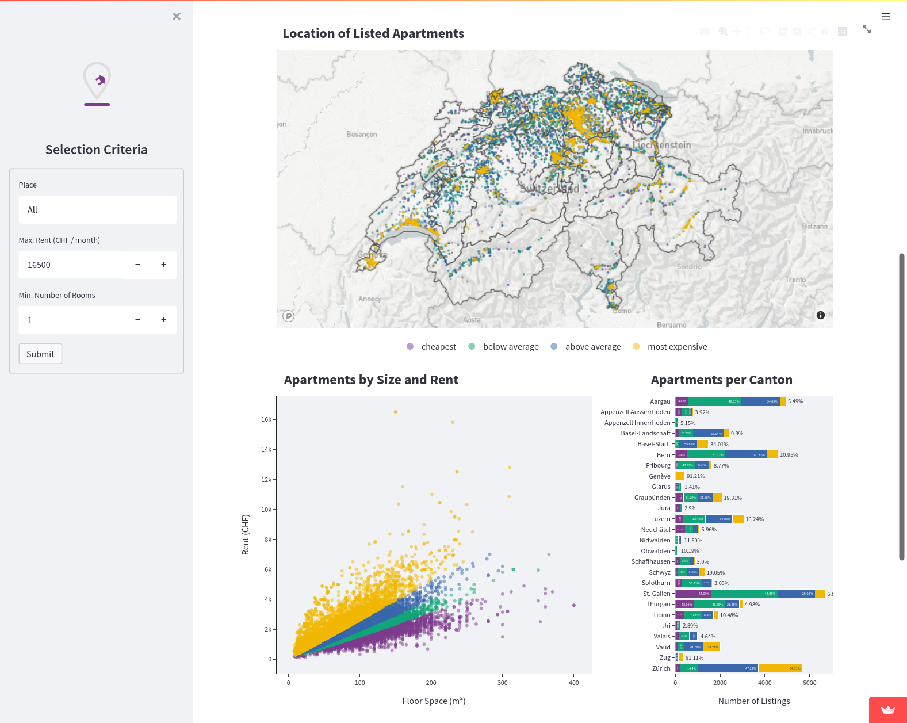

# Swiss Rents (Streamlit App)

<b>Project Status: Active -- [Visit the App](https://share.streamlit.io/alessine/swiss_rents)</b>

## Project Intro/Objective
The purpose of this project is to showcase how different factors influence the rents of apartments in Switzerland. Since almost 60% of residents in Switzerland live on rented properties, rather than owning a house, most people at one point face the question of whether their rent is within the normal range and how they might be able to find a more affordable space to live in. This app gives people the chance to explore a collection of apartment listings from 2019.

### Resources
* The dataset is publicly available: https://datenportal.info/wohnungsmarkt/wohnungsmieten/
* Swisstopo REFRAME API: https://geodesy.geo.admin.ch/reframe/ to turn LV95 into GPS coordinates

### Project Components
* Data Pre-processing
* APIs
* Data Visualization
* Modeling

### Technologies
* Python: Pandas, Requests, Plotly, Streamlit
* IDEs: PyCharm, Jupyter
* Deployment: Streamlit Cloud

## Project Description
Data on the price of housing is not so easy to come by. However, it is highly relevant in the real estate market as well as for individuals. The data used for this project was scraped from several different websites in 2019 and is publicly available. It contains about 50'000 rows of data, which can serve as a good basis for an analysis of the Swiss rental market. For the purpose of this project, the Swisstopo REFRAME API was used to supplement the local LV95 coordinates with GPS data for each apartment listing.

These were the two main assumptions formed from a basic, intuitive understanding of rents in Switzerland: 
<ol>
<li> The location (especially the proximity to urban centres) and the size of an apartment have a strong influence on the rent.</li>
<li> Other factors such as interior furnishing, age of the building and the type of ownership (public / private / cooperative / etc.) can lead to significant deviations from the expected rent based on location and size.</li>
</ol>

From the visualizations in the app, it is clear that the first assumption holds true. Size and location can be used to explain a large part of the variation in the dataset. To further quantify these effects, a linear regression model was put together in the modeling notebook linked below. The remaining variation could be due to the factors mentioned in the second assumption. However, the dataset does not contain the required information.

These insights from the data exploration and modeling are communicated with the help of a Streamlit App. The Plotly figures as well as the Streamlit widgets allow the user to interact with the visualizations, thereby enabling a personalized experience. The main difficulty faced with this type of presentation is the time required to plot the data on Streamlit. Removing unnecessary data, performing preprocessing steps outside the app and caching the data were three approaches that helped optimize performance.

## Featured Notebooks/Scripts
* [Notebook 1: Data Exploration and Modeling](https://github.com/Alessine/swiss_rents/blob/master/notebooks/nb1_220131_basic_eda_modelling.ipynb )
* [Notebook 2: Data pre-processing and Visualization](https://github.com/Alessine/swiss_rents/blob/master/notebooks/nb2_220202_advanced_viz.ipynb)
* [Python Script: Streamlit App](https://github.com/Alessine/swiss_rents/blob/master/streamlit_app.py)
