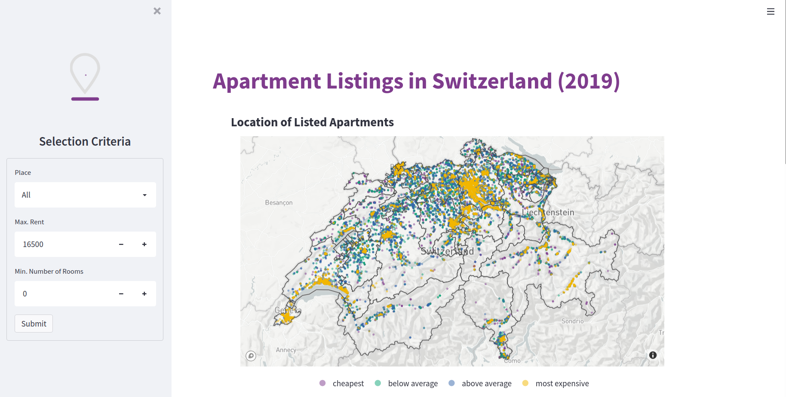

# Swiss Rents (Streamlit App)

<b>Project Status: Active -- [Visit the App](https://share.streamlit.io/alessine/swiss_rents)</b>

## Project Intro/Objective
The purpose of this project is to showcase how different factors influence the rents of apartments in Switzerland. Since almost 60% of residents in Switzerland live on rented properties, rather than owning a house, most people at one point face the question of whether their rent is within the normal range and how they might be able to find a more affordable space to live in. This app gives people the chance to explore a collection of apartment listings from 2019.

### Partner
* The dataset is publicly available: https://datenportal.info/wohnungsmarkt/wohnungsmieten/
* Swisstopo REFRAME API: http://geodesy.geo.admin.ch/reframe/ to turn LV95 into GPS coordinates

### Methods Used
* Data Pre-processing
* APIs
* Data Visualization

### Technologies
* Python: Pandas, Requests, Plotly, Streamlit
* IDEs: PyCharm, Jupyter
* Deployment: Streamlit Cloud

## Project Description
(Provide more detailed overview of the project.
Talk a bit about your data sources and what questions and hypothesis you are exploring.
What specific data analysis/visualization and modelling work are you using to solve the
problem? What blockers and challenges are you facing?
Feel free to number or bullet point things here)

## Featured Notebooks/Scripts
* [Notebook: Data pre-processing and Visualization](https://github.com/Alessine/swiss_rents/blob/master/notebooks/nb2_220202_advanced_viz.ipynb)
* [Python Script: Streamlit App](https://github.com/Alessine/swiss_rents/blob/master/streamlit_app.py)
